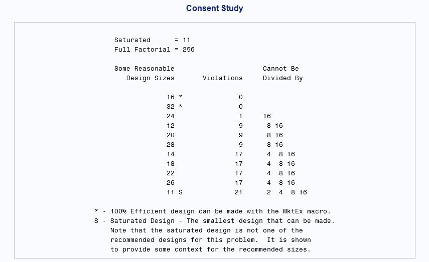
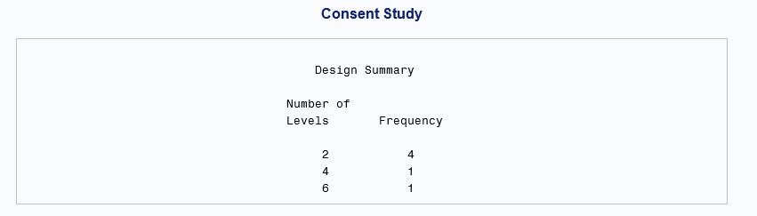
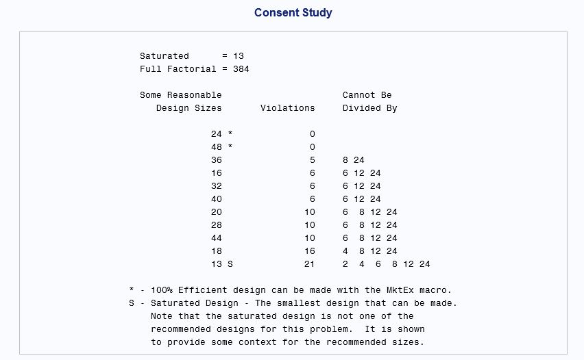
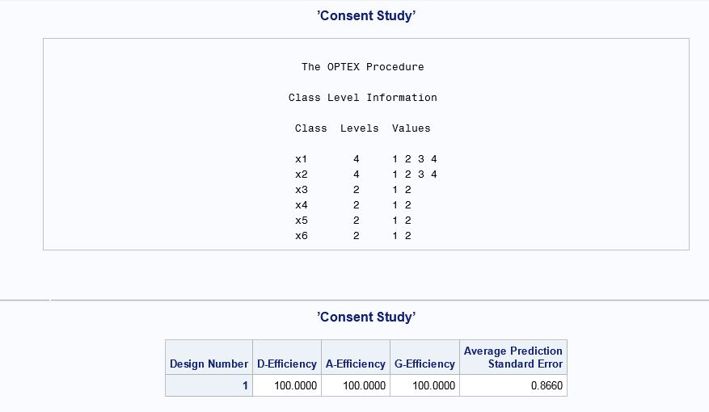
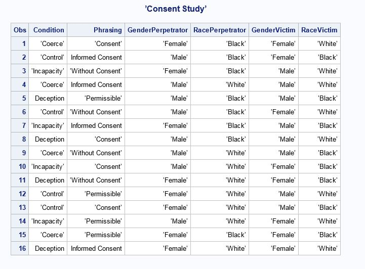

---

---

```{r setup, include=FALSE}
knitr::opts_chunk$set(echo = TRUE)
```

## Consent Study

Here are the steps for running the conjoint analysis with **4** levels of the factor **phrasing**. 

1. Run the **%Mktruns** macro to determine how many runs you need for a balanced and orthogonal design, given the number of factors and factor levels. The following **%Mktruns** syntax will find the number of *runs* for a balanced and orthogonal design (also called an *efficient* design) given the first factor has four levels, the second factor 4 levels, and the remaining four factors two levels each (See syntax below):


```{r eval=FALSE}
title 'Consent Study';
%mktruns(4 4 2 2 2 2)

```

Here are the results:



From the output above, the minimum number of runs for a balanced, orthogonal design (i.e., an "efficient" design) is 16 runs. Each "run" is a survey item that consists of a combination of the factor levels for all the factors.

With 72 runs, you can get a fully orthogonal and balanced design. This may be prohibitive, however. Notice in the **Violations** column. There are 4 violations for the *36-run* design. Recall that orthogonal means that there is an equal number of the same pairs in each row (run). Some pair combinations cannot be divided by 8.

But if the factor **phrasings** is reduced to six levels, these are the results:






Here you see that an orthogonal and balanced design can be achieved with just 24 runs, without having to mess with violations.

*(try to create orthogonal and balanced designs, if possible, to avoid specifying restrictions)*

#### Restrictions on Less Efficient Design

Now once we know the number of runs we want, we have the **%MktEx** macro create the design. The factors **x1 = Condition**, **x2 = Phrasing**, **x3 = GenderPerp**, **x4 = RacePerp**, **x5 = GenderVictim**, **x6 = RaceVictim**, and anyinteractions, e.g., **interact=1\*5** specifies an interaction between the first and fifth factor.The **%resmac** macro restricts any unrealistic combinations. With the **%resmac** macro you need to set **badness** command, telling how far off balance and orthogonality you're willing to go. You can set **bad** to the number of violations in the **runs** macro. But since we do not have to worry about the **badness** command, we can skip this step.

2. Format the data.
Let's first format the data with the SAS **proc** command:


```{r eval=FALSE}
proc format;
value cd 1=’Control’ 2=’Incapacity’ 3=’Coerce’ 4='Deception';
value ph 1=’Without Consent’ 2=’Permissible’ 3=’Consent’ 4='Informed Consent';
value gprp 1=’Male’ 2=’Female’;
value rprp 1=’Black’ 2=’White’;
value gv 1=’Male’ 2=’Female’;
value rv 1=’Black’ 2=’White’;
run;
```

Check the **Log** to make sure there is no red. If no red, the the file was run correctly.

3. We can then set up the design with the **%Mktex** macro. We are going to specify an interaction: the interaction effect of the gender of the perpetrator and the race of the victim. Here is the syntax:


```{r eval=FALSE}
%mktex(4 4 2 2 2 2, /* all of the factor levels */
interact=3*6, /*x3*x6 interaction between gender perpetrator and race of victim */
n=16, /* 16 runs */
seed=289) /* random number seed */
/*restrictions=resmac)  name of restrictions macro */
```




From the Efficiency statistics above, we see that this is a perfectly balanced and orthogonal design.

4. Now we assign labels with the **%Mktlab** command:


```{r eval=FALSE}
%mktlab(data=randomized, vars=Condition Phrasing GenderPerpetrator RacePerpetrator GenderVictim RaceVictim,
statements=format condition cd. phrasing ph. genderperpetrator gprp.
raceperpetrator rprp. gendervictim gv. racevictim rv.,
out=sasuser.consent2)
```

Check the **log** briefly to make sure the new dataset, **consent2** in the library **sasuser**, has 16 observations and 6 variables.

5. To generate the schematic or *blueprint* of the survey, use the **%mkteval** function (recall that the dataset is in the **sasuser** library and labeled **consent2**.) 

```{r eval=FALSE}
%mkteval(data=sasuser.consent2)
proc print data=sasuser.consent2; run;
```

Here is what the balance design would look like:



## Analyzing the Data

You can have SAS generate the questionnaire or create the questionnaire manually following the balanced and orthogonal specification table above. For analyzing the data, input the 24 responses per subject as rows of input lines:


The input from above corresponds to a study with 30 runs. You perform the metric conjoint analysis using the **PROC TRANSREG** function:


In the figure above, **factors** are specified as **class** variables. This will give you the main effects and any interactions **that you specify**. Notice the **brand|price** specification. This tells you that you want the main effects of **brand** and **price**, in addition to the interaction **brand X price**. The coefficients for a conjoint analysis are known as *part-worth utilities*. Not only does it display main effects, but it performs subject level analysis. Any subject with an R^2 value less than 0.3 are flagged for exclusion. The analysis should be based on subjects who are taking the task seriously Here is the syntax for a macro that will drop subjects who do not seem to fit the model:

```{r eval=FALSE}
data model;
set utils;
if statistic in (’R-Square’, ’Adj R-Sq’, ’Model’);
Subj = scan(_depvar_, 2);
if statistic = ’Model’ then do;
value = numdf;
statistic = ’Num DF’;
output;
value = dendf;
statistic = ’Den DF’;
output;
value = dendf + numdf + 1;
statistic = ’N’;
end;
output;
keep statistic value subj;
run;
proc transpose data=model out=summ;
by subj;
idlabel statistic;
id statistic;
run;
data summ2(drop=list);
length list $ 1000;
retain list;
set summ end=eof;
if adj_r_sq < 0.3 then do;
Small = ’*’;
list = trim(list) || ’ ’ || subj;
end;
if eof then call symput(’droplist’, trim(list));
run;
%put &droplist;
proc print label data=summ2(drop=_name_ _label_); run;
```

You can run the analysis again, this time dropping the subjects with poor fit. Here is the code:

```{r eval=FALSE}
proc transreg data=inputdata(drop=&droplist) utilities short noprint
separators=’’ ’, ’ lprefix=0 outtest=utils method=morals;
title2 ’Conjoint Analysis’;
model identity(sub:) =
class(brand | price meat mushroom ingredients / zero=sum);
output p ireplace out=results2 coefficients;
run;
```
